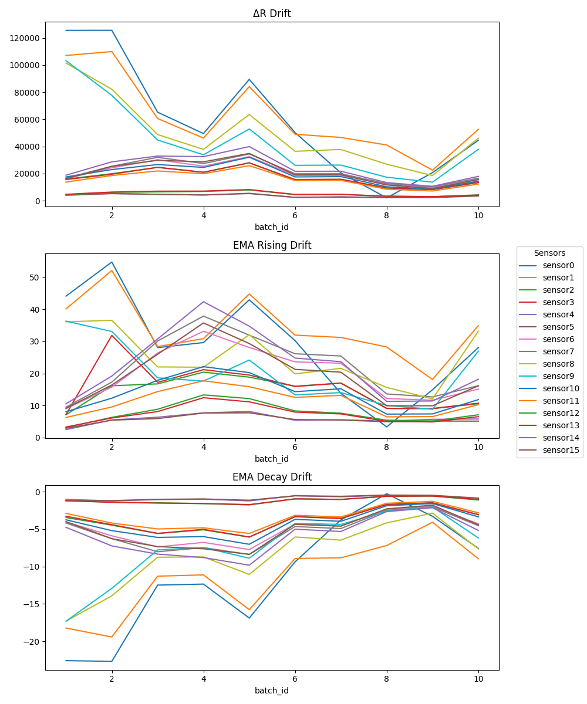
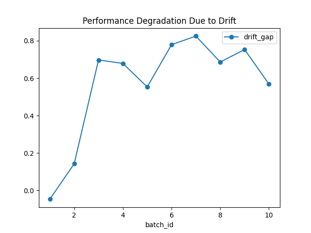

### Sensor Drift Analysis in Industrial ML Systems

Machine learning models deployed on industrial sensor data often degrade over time due to distribution drift.

This project analyzes sensor drift using the UCI Gas Sensor Array dataset and quantifies its impact on model performance through a controlled experimental setup.

The goal is to simulate real-world deployment conditions and demonstrate how drift affects model reliability.

#### What This Project Does

- Analyzes distribution drift across time-based sensor batches
- Identifies which features (steady-state vs dynamic) are most affected
- Evaluates model performance under drift using:
  - **Floor scenario** (no retraining)
  - **Oracle scenario** (full retraining)
- Quantifies performance degradation caused by drift

#### Key Results

- Significant distribution shift observed across batches, especially in EMA-based dynamic features
- Model trained on early data shows clear performance degradation on later batches
- Retraining restores performance, highlighting the operational cost of drift

#### Experiment Design

Two evaluation scenarios were used:

- **Floor (No Adaptation):**
  Model trained on Batch 1 and applied to all batches

- **Oracle (Full Adaptation):**
  Model retrained and evaluated within each batch

The gap between these scenarios quantifies the impact of drift.

#### Tech Stack

- Python
- Pandas / Numpy
- Scikit-learn
- SciPy
- Matplotlib / Seaborn